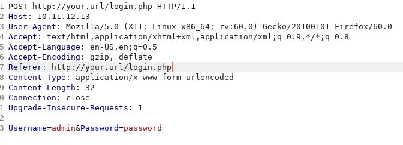
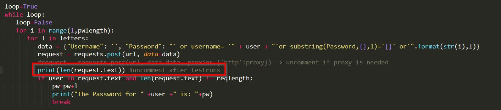
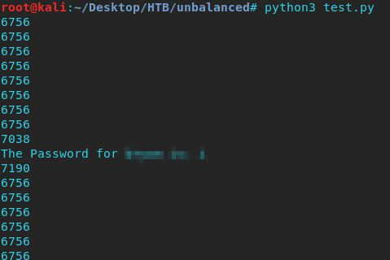
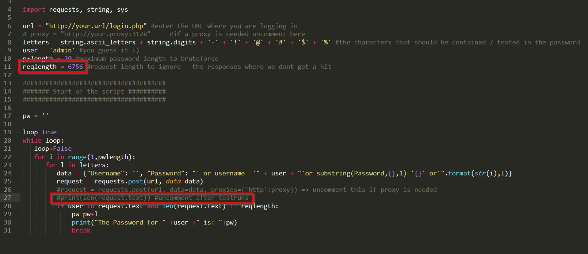
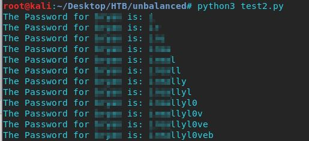

# XPATH-Brute
A bruteforcer in python for logins vulnerable to XPATH attacks.  

I came accross the need for this in a recent Hack the box challenge.  

In order for the script to work, we need to first determine the following:  
a) the correct values for the fieldnames of username and password  
b) the length of responses we want to ignore since they are our "wrong hits" on the password guessing  

So we first set up a proxy (in this case burp) to make things easier:  

  

In this case we have "Username" and "Password" as the two field values.

Next we are going to run the script for a first time in order to fetch the length value of the unwanted responses.  
This line of code will print the length of each response:  

  

which when run looks like so:  

  

We can now adept our script to fit our needs:  

  

That's it. We can now let the script do the work for us:  

   
